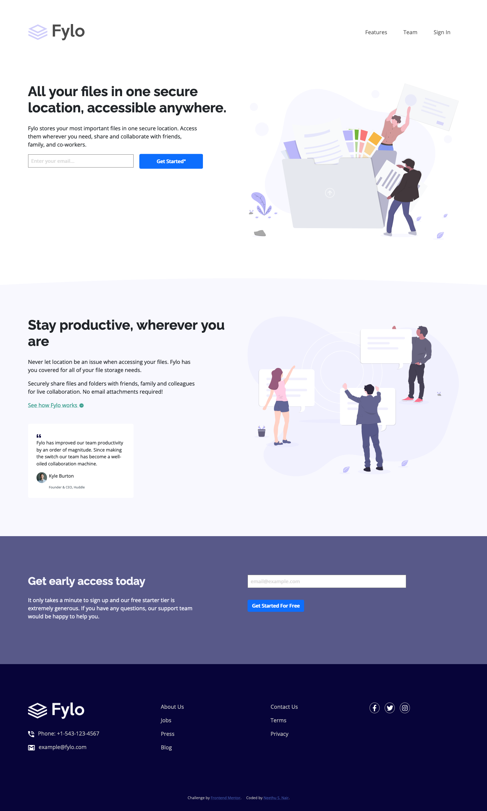
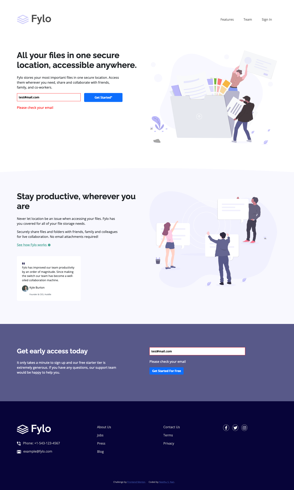
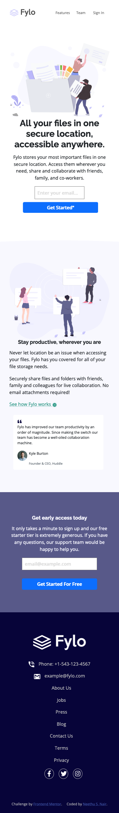

# Frontend Mentor - Fylo landing page with two column layout solution

This is a solution to the [Fylo landing page with two column layout challenge on Frontend Mentor](https://www.frontendmentor.io/challenges/fylo-landing-page-with-two-column-layout-5ca5ef041e82137ec91a50f5). Frontend Mentor challenges help you improve your coding skills by building realistic projects.

## Table of contents

- [Overview](#overview)
  - [The challenge](#the-challenge)
  - [Screenshot](#screenshot)
  - [Links](#links)
- [My process](#my-process)
  - [Built with](#built-with)
- [Author](#author)

## Overview

### The challenge

Users should be able to:

- View the optimal layout for the site depending on their device's screen size
- See hover states for all interactive elements on the page

### Screenshot

#### Desktop Design

#### Active State

#### Mobile Design

### Links

- Solution URL: [@nees101/FrontendMentor](https://www.frontendmentor.io/solutions/fylo-landing-page-design-using-css-custom-properties-bootstrap-and-js-Zn-j-42Yu)
- Live Site URL: [@nees101/Github]( https://nees101.github.io/Fylo-Landing-Page-with-two-column-layout/)

## My process

### Built with

- Semantic HTML5 markup
- CSS custom properties
- CSS Grid
- Bootstrap5
- Vanilla Javascript

## Author

- Frontend Mentor - [@nees101](https://www.frontendmentor.io/profile/nees101)
- Github - [@nees101](https://www.github.com/nees101)
